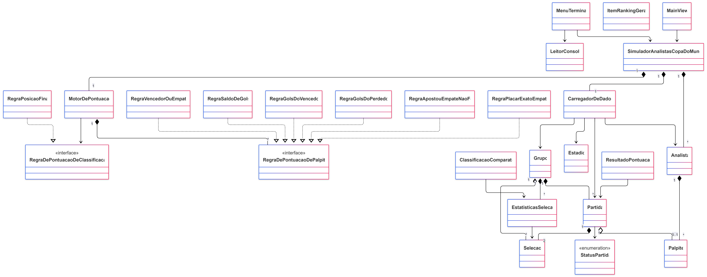

# ⚽ Simulador Analistas Esportivos: Copa do Mundo

Sistema em **Java 21** para acompanhar a fase de grupos da Copa do Mundo como um "bolão de analistas". Cada analista registra seus palpites para as partidas, o sistema calcula a classificação dos grupos, carrega os resultados oficiais, pontua os palpites e monta um ranking entre os analistas.

Projeto desenvolvido em equipe para a disciplina de **Práticas de Programação Orientada a Objetos (PPOO)** da UFLA, a partir de um código-base fornecido pelo professor com as interfaces de contrato e a estrutura de pastas.

## ✨ Funcionalidades

- **Partidas e grupos:** carregamento da tabela de partidas da primeira fase a partir de CSV e cálculo da classificação de cada grupo
- **Palpites:** registro de palpites por analista, com criação de perfil e persistência dos palpites
- **Resultados oficiais:** carregamento dos resultados e sincronização automática de placares via HTTP
- **Pontuação:** pontos por palpite de cada partida, pelo conjunto de palpites e pela classificação final dos grupos
- **Rankings:** ranking geral de prestígio e ranking comparativo entre analistas
- **Duas interfaces:** menu no terminal e interface web com dashboard de jogos, resultados e registro de palpites

## 🛠️ Tecnologias


## 🏗️ Arquitetura

O código é dividido em camadas, separando regra de negócio de interface:

```text
src/
  MainApp.java                 # ponto de entrada (terminal)
  br/ufla/copa/
    core/
      contracts/               # interfaces de regra (contratos)
      model/                   # entidades: Partida, Selecao, Grupo, Palpite, Analista...
      service/                 # orquestração: simulador, motor de pontuação, ranking
      rules/  data/
    ui/
      terminal/                # interface textual
      web/                     # interface web com Vaadin Flow
  resources/                   # partidas.csv e demais recursos
```

O projeto aplica encapsulamento, herança, polimorfismo, composição e agregação, além de tratamento de exceções.

### Diagrama de classes



## 🚀 Como executar

Pré-requisito: **JDK 21**. As dependências são baixadas pelo Maven Wrapper na primeira execução, que por isso demora um pouco.

**No VS Code:** abra a pasta do projeto e pressione `F5`. O terminal e a interface web sobem juntos; a web fica em `http://localhost:8080`.

**Só a interface web:**

```bash
./mvnw jetty:run
```

No Windows (PowerShell ou Prompt):

```powershell
.\mvnw.cmd jetty:run
```

## 👥 Equipe

- **Pyêtro Augusto Malaquias** ([@Petrus012](https://github.com/Petrus012))
- **Guilherme Lírio Miranda** ([@guilirio](https://github.com/guilirio))
- **Lídio Júnior Pereira Batista** ([@lidiojr0](https://github.com/lidiojr0))

<details>
<summary><b>Histórias de usuário implementadas</b></summary>
<br>

| Id | Descrição |
|-----|-----------|
| H01 | Inicialização da Tabela de Partidas |
| H02 | Registro de Palpites |
| H03 | Tabela de Classificação do Grupo |
| H04 | Carregamento dos Resultados Oficiais |
| H05 | Pontuação do Palpite de Uma Partida |
| H06 | Pontuação de Todos os Palpites |
| H07 | Pontuação pela Classificação na primeira fase |
| H08 | Criação de Perfil de Analista e Persistência dos Palpites |
| H09 | Ranking Geral de Prestígio |
| H10 | Sincronização Online de Resultados Oficiais |
| H11 | Diagrama de Classes Simplificado e Checklist |
| H12 | Dashboard de Jogos e Resultados Oficiais |
| H13 | Registro de Palpites via Web |
| H14 | Ranking Comparativo de Analistas |
| H15 | Atualização do Diagrama de Classes Simplificado e Checklist |

</details>
