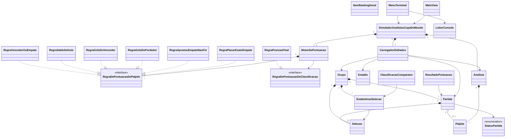

# Diagrama de Classes — Simulador de Analistas Copa do Mundo 2026

```mermaid
classDiagram

    %% ── INTERFACES ──────────────────────────────────────────────────────────
    class RegraDePontuacaoDePalpite {
        <<interface>>
    }
    class RegraDePontuacaoDeClassificacao {
        <<interface>>
    }

    %% ── ENUMERAÇÃO ───────────────────────────────────────────────────────────
    class StatusPartida {
        <<enumeration>>
    }

    %% ── MODEL ────────────────────────────────────────────────────────────────
    class Selecao
    class Palpite
    class Analista
    class Partida
    class Estadio
    class EstatisticasSelecao
    class Grupo
    class ClassificacaoComparator

    %% ── REGRAS DE PONTUAÇÃO ──────────────────────────────────────────────────
    class RegraVencedorOuEmpate
    class RegraSaldoDeGols
    class RegraGolsDoVencedor
    class RegraGolsDoPerdedor
    class RegraApostouEmpateNaoFoi
    class RegraPlacarExatoEmpate
    class RegraPosicaoFinal

    %% ── SERVICE ──────────────────────────────────────────────────────────────
    class SimuladorAnalistasCopaDoMundo
    class MotorDePontuacao
    class ResultadoPontuacao
    class ItemRankingGeral

    %% ── DATA ─────────────────────────────────────────────────────────────────
    class CarregadorDeDados

    %% ── UI TERMINAL ──────────────────────────────────────────────────────────
    class MenuTerminal
    class LeitorConsole

    %% ── UI WEB ───────────────────────────────────────────────────────────────
    class MainView

    %% ── REALIZAÇÕES (implementação de interfaces) ────────────────────────────
    RegraVencedorOuEmpate    ..|> RegraDePontuacaoDePalpite
    RegraSaldoDeGols         ..|> RegraDePontuacaoDePalpite
    RegraGolsDoVencedor      ..|> RegraDePontuacaoDePalpite
    RegraGolsDoPerdedor      ..|> RegraDePontuacaoDePalpite
    RegraApostouEmpateNaoFoi ..|> RegraDePontuacaoDePalpite
    RegraPlacarExatoEmpate   ..|> RegraDePontuacaoDePalpite
    RegraPosicaoFinal        ..|> RegraDePontuacaoDeClassificacao

    %% ── COMPOSIÇÃO / AGREGAÇÃO (model) ──────────────────────────────────────
    Partida             "1" *-- "2" Selecao
    Partida             "1" o-- "0..1" Palpite
    Partida                 -->       StatusPartida
    Analista            "1" *-- "*"  Palpite
    Grupo               "1" *-- "*"  Selecao
    Grupo               "1" *-- "*"  Partida
    Grupo               "1" *-- "*"  EstatisticasSelecao
    EstatisticasSelecao     -->       Selecao
    ClassificacaoComparator -->       EstatisticasSelecao

    %% ── SERVICE ──────────────────────────────────────────────────────────────
    SimuladorAnalistasCopaDoMundo "1" *-- "1" CarregadorDeDados
    SimuladorAnalistasCopaDoMundo "1" *-- "1" MotorDePontuacao
    SimuladorAnalistasCopaDoMundo "1" *-- "*" Analista
    MotorDePontuacao              "1" *-- "*" RegraDePontuacaoDePalpite
    MotorDePontuacao                  -->      RegraDePontuacaoDeClassificacao
    ResultadoPontuacao                -->      Partida

    %% ── DATA ─────────────────────────────────────────────────────────────────
    CarregadorDeDados --> Grupo
    CarregadorDeDados --> Partida
    CarregadorDeDados --> Estadio
    CarregadorDeDados --> Analista

    %% ── UI ───────────────────────────────────────────────────────────────────
    MenuTerminal --> SimuladorAnalistasCopaDoMundo
    MenuTerminal --> LeitorConsole
    MainView     --> SimuladorAnalistasCopaDoMundo
```
